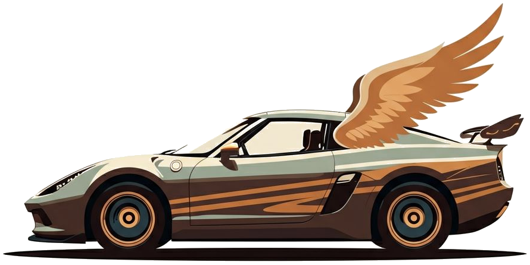
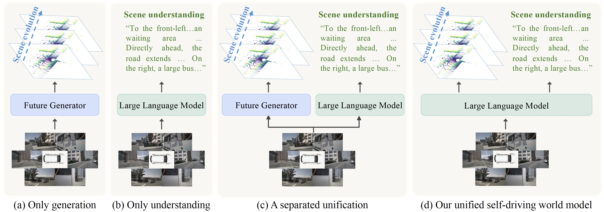
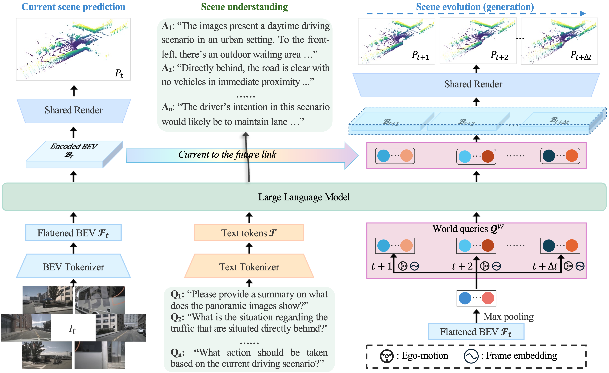
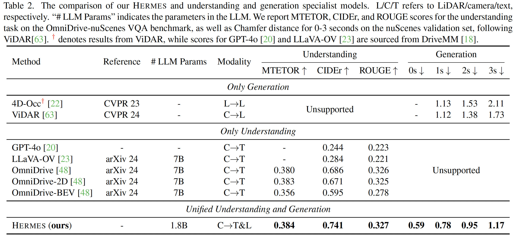

<div  align="center">    
 
</div>

</div>

<div align="center">
<h3>HERMES: A Unified Self-Driving World Model for Simultaneous <br>3D Scene Understanding and Generation</h3>


[Xin Zhou](https://lmd0311.github.io/)<sup>1\*</sup>, [Dingkang Liang](https://dk-liang.github.io/)<sup>1\*†</sup>, Sifan Tu<sup>1</sup>, [Xiwu Chen](https://scholar.google.com/citations?user=PVMQa-IAAAAJ&hl=en)<sup>3</sup>, [Yikang Ding](https://scholar.google.com/citations?user=gdP9StQAAAAJ&hl=en)<sup>2†</sup>, Dingyuan Zhang<sup>1</sup>, Feiyang Tan<sup>3</sup>,<br> [Hengshuang Zhao](https://scholar.google.com/citations?user=4uE10I0AAAAJ&hl=en)<sup>4</sup>, [Xiang Bai](https://scholar.google.com/citations?user=UeltiQ4AAAAJ&hl=en)<sup>1</sup>

<sup>1</sup>  Huazhong University of Science & Technology, <sup>2</sup>  MEGVII Technology, <br><sup>3</sup>  Mach Drive, <sup>4</sup>  The University of Hong Kong

(\*) Equal contribution. (†) Project leader.

[](https://arxiv.org/abs/2501.14729)
[](https://huggingface.co/LMD0311/HERMES)
[](https://lmd0311.github.io/HERMES/)
[](https://github.com/tatsu-lab/stanford_alpaca/blob/main/LICENSE)

Check our *awesome* for the latest World Models! [](https://github.com/LMD0311/Awesome-World-Model)


</div>

## 📣 News
- **[2025.07.14]** Code, pretrained weights, and used processed data are now open-sourced. 🔥
- **[2025.06.26]** HERMES is accepted to **ICCV 2025**! 🥳
- **[2025.01.24]** Release the demo. Check it out and give it a star 🌟!
- **[2025.01.24]** Release the [paper](https://arxiv.org/abs/2501.14729). 🔥
 <div  align="center">    
 
</div>

---
## Abstract

Driving World Models (DWMs) have become essential for autonomous driving by enabling future scene prediction. However, existing DWMs are limited to scene generation and fail to incorporate scene understanding, which involves interpreting and reasoning about the driving environment. In this paper, we present a unified Driving World Model named **HERMES**. Through a unified framework, we seamlessly integrate scene understanding and future scene evolution (generation) in driving scenarios. Specifically, **HERMES** leverages a Bird‘s-Eye View (BEV) representation to consolidate multi-view spatial information while preserving geometric relationships and interactions. Additionally, we introduce world queries, which incorporate world knowledge into BEV features via causal attention in the Large Language Model (LLM), enabling contextual enrichment for both understanding and generation tasks. We conduct comprehensive studies on nuScenes and OmniDrive-nuScenes datasets to validate the effectiveness of our method. **HERMES** achieves state-of-the-art performance, reducing generation error by 32.4% and improving understanding metrics such as CIDEr by 8.0%.

---
## Overview

<div  align="center">    
 
</div>

---
## Getting Started

We provide detailed guides to help you quickly set up, train, and evaluate HERMES:

- **[Environment Setup](docs/Environment.md):** Step-by-step instructions for installing dependencies and preparing your environment.
- **[Data & Weights Preparation](docs/Data.md):** How to prepare the datasets and download pretrained weights.
- **[Usage Guide](docs/Usage.md):** Instructions for training, inference, and evaluation.

Please follow these guides for a smooth experience.

---
## Demo

<div  align="center">    
 
 <center> Example 1 </center> <br>
</div>

<div  align="center">    
 
 <center> Example 2 </center> <br>
</div>

<div  align="center">    
 
 <center> Example 3 </center> <br>
</div>

---
## Main Results

<div  align="center">    
 
</div>

---
## To Do

- [x] Release demo.
- [x] Release checkpoints.
- [x] Release training code.
- [x] Release processed datasets.
- [ ] Release DeepSpeed support.

## Acknowledgement

This project is based on BEVFormer v2 ([paper](https://arxiv.org/abs/2211.10439), [code](https://github.com/fundamentalvision/BEVFormer)), InternVL ([paper](https://arxiv.org/abs/2404.16821), [code](https://github.com/OpenGVLab/InternVL)), UniPAD ([paper](https://arxiv.org/abs/2310.08370), [code](https://github.com/Nightmare-n/UniPAD)), OminiDrive ([paper](https://arxiv.org/abs/2405.01533), [code](https://github.com/NVlabs/OmniDrive)), DriveMonkey ([paper](https://arxiv.org/abs/2505.08725), [code](https://github.com/zc-zhao/DriveMonkey)). Thanks for their wonderful works.

## Citation

If you find this repository useful in your research, please consider giving a star ⭐ and a citation.
```bibtex
@inproceedings{zhou2025hermes,
  title={HERMES: A Unified Self-Driving World Model for Simultaneous 3D Scene Understanding and Generation},
  author={Zhou, Xin and Liang, Dingkang and Tu, Sifan and Chen, Xiwu and Ding, Yikang and Zhang, Dingyuan and Tan, Feiyang and Zhao, Hengshuang and Bai, Xiang},
  booktitle={Proceedings of the IEEE/CVF International Conference on Computer Vision},
  year={2025}
}
```
